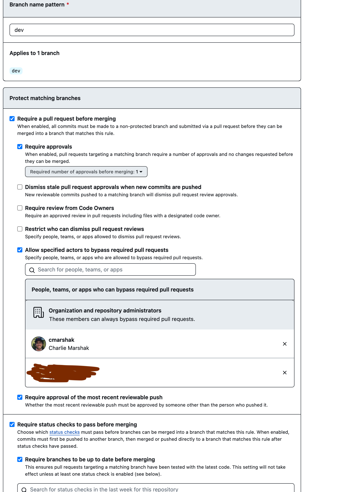

# Notes on Github Workflows for CI/CD

**Disclaimer**: this a rough draft, meant for ACCESS team.
It likely contains errors and will be clunky in communication/organization.
I can't believe how much ChatGPT knows about all these topics, too!

# Table of Contents

- [Notes on Github Workflows for CI/CD](#notes-on-github-workflows-for-cicd)
- [Table of Contents](#table-of-contents)
- [Background](#background)
  - [Examples of Libraries with the CI/CD](#examples-of-libraries-with-the-cicd)
- [Quick Guide](#quick-guide)
  - [Summary of Actions/Workflows](#summary-of-actionsworkflows)
  - [Checklist for Setup](#checklist-for-setup)
- [Diving Deeper](#diving-deeper)
  - [A. Testing](#a-testing)
    - [Digression about Testing](#digression-about-testing)
  - [B. Static Analysis](#b-static-analysis)
    - [Static analysis in `VScode` (or another IDE)](#static-analysis-in-vscode-or-another-ide)
  - [C . Release](#c--release)
  - [General Outline of Release Workflow (Developer Perspective)](#general-outline-of-release-workflow-developer-perspective)
    - [Changelog](#changelog)
    - [Release Cycle](#release-cycle)
    - [A Checklist for Release](#a-checklist-for-release)
    - [Semantic Versioning](#semantic-versioning)
    - [General Setup for Automatic Release Cycle](#general-setup-for-automatic-release-cycle)
  - [Building your library](#building-your-library)
    - [PyPI Setup](#pypi-setup)
      - [PyPI Account setup](#pypi-account-setup)
    - [Conda-forge Setup](#conda-forge-setup)
      - [Why `conda-forge`? Isn't `PyPI` enough?](#why-conda-forge-isnt-pypi-enough)
    - [More setup for release](#more-setup-for-release)
    - [Engine for Automatically Tagging Releases](#engine-for-automatically-tagging-releases)
  - [Branch Protection and Github Branch Setup](#branch-protection-and-github-branch-setup)
  - [Common Gotchas](#common-gotchas)
    - [Missing a `bumpless`, `patch`, `minor`, `major` label with PR to Main (i.e. a release).](#missing-a-bumpless-patch-minor-major-label-with-pr-to-main-ie-a-release)
    - [A release v... that is not correctly synced to Changelog \[v...\]](#a-release-v-that-is-not-correctly-synced-to-changelog-v)


# Background

This is based on the Continuous Integration and Continuous Deployment (CI/CD) workflow for python libraries hosted on Github.
These workflows were developed and maintained by ASF's Joe Kennedy, Andrew Johnston, Jake Herman, and the HyP3 team.
This article assumes familiarity with git, python, pytest and Github.
Specifically, this article assumes that you have have a python project on Github that you can push/pull from your terminal or IDE.
That said, I am a CI/CD novice and this article has been written as a personal reference to set up projects with the outlined CI/CD workflows.

The setup for any automated CI/CD is highly opinionated and there are many ways to develop such workflows.
I am biased of the CI/CD discussed here simply because I am familiar with *using* it, so take my perspective with a grain of salt.
Moreover, I am a novice in this area, and many of the libraries we have worked on are developed by relatively small teams (1 - 10 people).
I look at more complicated, nuanced workflows (i.e. in the `.github/workflows` folder of a large python library) and am quickly confused.

The underlying guiding philosophy is that we (i.e. developers) are all lazy when it comes to CI/CD and we like the tools to be simple and used via muscle memory.
The more maintainance of CI/CD workflows, the less likely we are to use them.
Building up CI/CD scaffolding allows for quicker release cycles, essential for any good software development. 
Of course, the scaffolding is easy to trip on, particularly if you are just getting started.
Thus, we have this guide to provide clarity on what the scaffolding is and how to our particular flavor of scaffolding up.
If there are better ways in the future, we will be the first to adopt them.

The subset of CI/CD we are interested in are:

1. Software should work consistently (based on tests)
2. Software should be easy to read
    + without extra variables defined, unusually long lines, reserved variable names, etc.
    + consistent formatting (`ruff` is a very popular linter/formatter for python which incorporates previous linting)
    + Consistently typed variables (nice to have). In other words, no `mypy` currently
3. Software versions and their associated environments should be easy to track.
    + When software generates data, the data should point back to the sofware that generated it
    + If a dependency changes the runtime environment (e.g. `gdal` is updated and crashes the code), it should be easy to track down possible dependency culprits (i.e. which `gdal` version made and issue)
4. It should be easy to install (including the software dependencies)
    + It should be clear how to install software related to a particular release

With these four tenants, we need an automated ways to:
<ol type="A">
  <li>Test (for 1. above),</li>
  <li>Static Analysis (for 2. above) and</li>
  <li>Release (for 3. and 4. above).</li>
</ol>
On top of that, we will have Docker containers that further codify the runtime environment if we are using our library for cloud computing. Thus, we will need ways of performing C. for docker containers.

## Examples of Libraries with the CI/CD

Sometimes it is easier to understand CI/CD not by a long article, but by example. Here are some examples of repositories that utilize this CI/CD.

+ [`dem-stitcher`](https://github.com/ACCESS-Cloud-Based-InSAR/dem-stitcher)
+ [`tile-mate`](https://github.com/OPERA-Cal-Val/tile-mate)
+ [`DockerizedTopsApp`](https://github.com/ACCESS-Cloud-Based-InSAR/DockerizedTopsApp)

There is a cookiecutter for a "hyp3-plugin" [here](https://github.com/ASFHyP3/hyp3-cookiecutter). 
Although a "plugin" is not the focus of the article, the plugin cookie cutter provides the scaffolding of above and a bit more (namely the Docker pieces mentioned as optional). 
The cookie-cutter assumes there is a script/entrypoint as the "standard" way to run the library from the command line. 
Since there is a lot of setup, it's easier for me to remove things than add something in a manner that is incorrect. Thus, the cookie-cutter linked is very helpful.

# Quick Guide

## Summary of Actions/Workflows

All the workflows are documented at https://github.com/ASFHyP3/actions.
Having centralized workflows means anytime the workflows are updated in this location, they are almost automatically deployed to
*all* the software packages.
Even Github actions are changing a lot!
Here is a quick summary and the secrets they require.

More details of what is needed for each is detailed below.

+ [Changelog Check](https://github.com/OPERA-Cal-Val/tile-mate/blob/dev/.github/workflows/changelog.yml) - make sure changelog is modified on PRs to `main` or `dev`. Important for release.
+ [Distribute to PyPi](https://github.com/OPERA-Cal-Val/tile-mate/blob/dev/.github/workflows/distribute.yml) - on merges to `main`. Requires `PyPI` user token; preferably using a shared account.
+ Makes sure that `main` PR has a label as `major`, `minor`, `patch` or `bumpless`.
+ [Distribute to Github](https://github.com/OPERA-Cal-Val/tile-mate/blob/dev/.github/workflows/release-github.yml) - this distributes the tar file to github release. Requires a Github user token to automate fast-forward merge to `dev` from `main` which updates automatically incremented annotated tags.
+ [Static Analysis](https://github.com/OPERA-Cal-Val/tile-mate/blob/dev/.github/workflows/static-analysis.yml) - `ruff` and `flake8` static analysis as well as a secret inspector.
+ [Tag version](https://github.com/OPERA-Cal-Val/tile-mate/blob/dev/.github/workflows/tag.yml) - uses the github PR labels to create an annotated tag for release. Requires the repo/org user to automate this. See this [line](https://github.com/OPERA-Cal-Val/tile-mate/blob/dev/.github/workflows/tag.yml#L15).
+ [Test](https://github.com/OPERA-Cal-Val/tile-mate/blob/dev/.github/workflows/test.yml) - the pytest workflow
+ [Build](https://github.com/ACCESS-Cloud-Based-InSAR/DockerizedTopsApp/blob/dev/.github/workflows/build.yml) - builds and releases docker containers for `dev` and `main` branches. Requires the shared account Github token as indicated in this [line](https://github.com/ACCESS-Cloud-Based-InSAR/DockerizedTopsApp/blob/dev/.github/workflows/build.yml#L26)

## Checklist for Setup

This is meant to be a checklist.
The detailed descriptions are below in [Diving Deeper](#diving-deeper).

1. Create a shared email for project/org and create accounts on
   + PyPI
   + Github
2. Make sure project  
   + is version controlled through `git` and has a default `dev` branch on `Github`
   + has `pyproject.toml` with `scm` setup and initilal 0.0.0 annotated tag on `dev` and `main` branches (see details in [Building Your Library](#building-your-library))
   + has `environment.yml` for environment setup
   + has `pytest` test suite
   + has a `CHANGELOG.md` formatted in standard [way](https://common-changelog.org/) and has version that will be initial release. Here is a [sample](https://github.com/ACCESS-Cloud-Based-InSAR/s1_frame_enumerator/blob/dev/CHANGELOG.md).
3. Create secrets for necessary action workflow calls in particular:
   + Github user token for `Build` and `Tag version` actions in the [Summary of Actions/Workflows](#summary-of-actionsworkflows) above
   + PyPI user token for distribution as in `Distribute to PyPI` action in the [Summary of Actions/Workflows](#summary-of-actionsworkflows) above
4. Create branch protections for `dev` and `main`
   + Make sure checks have to pass before merging
   + Make sure that the shared/bot account can perform merges without checks passing on `dev` (this is required for fast-forward merges tags)

# Diving Deeper

We organize the actions and setup based on the categories of `Testing`, `Static Analysis` and `Release` noted above. 
We also go into releasing the software on standard package repositories and various needed setup.

## A. Testing

Writing a test suite is a crucial part of any software development. 
In terms of github workflows, this is one of the easiest pieces to get setup because it assumes the test suite has been developed already (specifically, in [`pytest`](https://docs.pytest.org/)).
Testing is important because, as the library grows and gets modified, it is very helpful to have a test suite that is run to ensure the core does not change. 
Here is a sample [workflow](https://github.com/ACCESS-Cloud-Based-InSAR/dem-stitcher/blob/dev/.github/workflows/test.yml) from `dem-stitcher` and [another](https://github.com/OPERA-Cal-Val/tile-mate/blob/dev/.github/workflows/test.yml) that uses the ASF action from `tile-mate`. 
We are *leaning into* using the "reusable" workflows from ASF to ensure long-term maintainability of CI/CD across all the software we are developing.

### Digression about Testing

This is a brief section not relevant for the rest of the article.
Further, I am still getting better at writing test-suites.
We mention a few contextual testing terminology to provide 
There are two types of tests that we typically see: integration tests and unit tests. 
*Integration tests* are running large workflows end-to-end and comparing output data with fixed "golden" datasets.
Such integration tests can take time to run particular with large science workflows.
*Unit tests* are typically tests that verify the correctness of small parts of the code (functions, object intitiation, error handling, etc).
There is not necessarily a clean distinction in practice because sometimes there can be long-running functions or object initiation.
Frequently, a geoscience library needs input data to be downloaded from data repository.
However, downloading data is a time sink.
It is important to be comfortable *mocking* data for tests.
This simply means being able to take the data request part of a workflow and inject local test data to speed up tests.
We have found a lot of success using [`pytest-mock`](https://pypi.org/project/pytest-mock/). 
There is also  [`monkey-patch`](https://docs.pytest.org/en/7.1.x/how-to/monkeypatch.html) in `pytest`, and [`magic-mock`](https://docs.python.org/3/library/unittest.mock.html)/[`mock`](https://docs.python.org/3/library/unittest.mock.html#unittest.mock.patch) in `unittests`.
An example of using `pytest-mock` can be seen [here](https://github.com/dbekaert/RAiDER/blob/dev/test/test_GUNW.py) - note in mocking we can not only mock the data but make sure the number of calls to the mocked data/functions/instances are precisely what we expect.
There is a lot we have mentioned (and not mentioned) beyond the scope of the article, but this is extraordinarily important for smooth long-term development.
There is even a type of development call ["test-driven development"](https://en.wikipedia.org/wiki/Test-driven_development), which for every new feature you write the test before you start the development to ensure the correctness of your development. This is a tall order (for me); however, I find it is good practice to write tests for new features and functionality as they are added.

As edge cases get uncovered, as invariably they do, it is important to include these cases in the test-suite so future users are aware of this.
As code becomes more complex, a test can offer insight into the choices being made.
Specifically, it provides readable insight into the larger API as complex changes are made.
For example, in `dem-stitcher`, there are missing 30 meter tiles over Armenia and Azerbaijan, but those tiles are not missing over 90 meters.
So, we simply upsample these tiles for general users.
An integration test such as this [one](https://github.com/ACCESS-Cloud-Based-InSAR/dem-stitcher/blob/dev/tests/test_missing.py#L51) shows the expected output of the API without having to understand the nuances of the larger code base.

## B. Static Analysis

Static analysis is the process by which a *fast* rule-based check of code can spot errors or formatting issues that make code more readable.
However, nobody wants to be thinking about static-analysis very long after it has been setup.
Nonetheless, static-analysis (once used) speeds up development because "trivial" errors are caught before pushing to a Git repository.
Specifically, static analysis catches those easy-to-miss errors like `NameError: name 'x' is not defined` because a developer renamed a variable input, but didn't follow it through a function.
Static analysis is easy to very setup in github workflows.
The hardest part is aligning the developers IDE to that used by github.
[`Here`](https://github.com/OPERA-Cal-Val/tile-mate/blob/dev/.github/workflows/static-analysis.yml) is a sample workflow.
It uses [`flake8`](https://flake8.pycqa.org/en/latest/) and [`ruff`](https://github.com/astral-sh/ruff), though the latter supersedes the latter.
It also has a "secret" detector to help ensure a developer is not committing passwords to the repository.

### Static analysis in `VScode` (or another IDE)

Again, static analysis needs to be easy for a "lazy" developer.
The hardest part about static analysis setup is making sure your IDE linter aligns with whatever you are using for your github action.
That way you don't have to wait until you push your code to github to figure out if your code is not correctly formatted (though it still happens).
Usually, if you can follow what the python community is doing, it makes a IDE setup a little easier.
For example, the official Microsoft extension to VSCode contains a `flake8` linter that is as simple as changing the linting formatting.
`Ruff` is not in the official python extension (yet), but the extension is maintained by the developers of original linter/formatter and has 320k downloads.
Generally, I don't want to be thinking about how to setup how `flake8` or `ruff`.
[Here](https://github.com/ASFHyP3/hyp3/blob/develop/Makefile#L46C2-L46C73) is a sample flake8 command with customized arguments - note one of the arguments adjusts the acceptable line length from 80 to 120.
In the ASF action, flake8 is called with the above arguments and as well as `ruff`. 
In VSCode, I can manually select "format document" (after pressing `command + shift + P`) each time I want ruff to update the formatting of a python document in VSCode.
I can also update the setting so each save automatically does so, though this can be tricky since not all projects that you contribute will have the same formatting guidelines.
What's nice about `ruff` is you can customize the formatting in the `pyproject.toml` as [here](https://github.com/OPERA-Cal-Val/tile-mate/blob/dev/pyproject.toml#L64-L85).

We also remark that one could use "pre-commit" hook see [here](https://pre-commit.com/).
This simply means that everytime you commit, formatting is performed.
Lots of projects do this including [skimage](https://github.com/scikit-image/scikit-image/blob/main/.pre-commit-config.yaml).
At some point, this may be desired to further take the burden off the developer to format.


## C . Release

The release workflows are tricky because it encompasses three items:

1. Publication to PyPI
2. Release to `conda-forge`
3. Release to `github`

If there is docker, then we have additional aspects:

4. Build docker container
5. Release docker container to a public/private registry (e.g. Docker Container Registry or AWS ECR)

Each release is also *manually* tracked in the repository Changelog. There will be actions to ensure this is done upon each appropriate PR.
We also have a notion of a "bumpless" release in which the CI/CD changes. Note that will not effect the library and does not constitute an additional library release.


## General Outline of Release Workflow (Developer Perspective)

There are two main branches in the setup: 1. `dev` and 2. `main`.

The `dev` branch is the development branch.
The `main` branch is the released stable version.
When you merge changes from `dev` into `main`, then you have released a new version and you should have automated all the items for a release.

Let's dive in a bit deeper.
`dev` represents the latest development features and allows multiple developers to play with the latest features in a *centralized branch*.
It builds off the fact that each new feature should can be developed in a separate branch and then be integrated into the package first via `dev`.
In other words, one can have different branches each with different features (e.g. branches `feature-0`, `feature-1`, ...) and then merge them into `dev`.
When `dev` is ready for release, simply merge into `main`.
Alternatively, one could have only a single release branch without a `dev` branch; clearly this is popular with many well-known python libraries e.g. rasterio, scikit-image, to name drop a few.

One of the benefits that we have found with this setup of `dev` and `main` branches is that it allows developers to easily track environment issues.
So long as the CI/CD is setup to run a test suite building the environment *from scratch* using the latest environment file (or build Docker images), it is easy to see if a recently released feature that was just passing a test suite, failed because of a dependency issue.
I find having the `dev` buffer provides a little breathing room for such issues, too, as you can easily track using the `main` (release) branch when the libraries tests and builds were last succeeding.

### Changelog

One of the important pieces of the release cycle (that does take some getting used to) is ensuring an update of the `CHANGELOG.md`.
The Changelog is one of areas of *manually* tracking the version.
If the latested release version is `1.2.3`, and a developer is opening a PR to `dev`, then depending on the latest features being added to `dev` the next version in the `CHANGELOG.md` should be `1.2.4` (unless there is a major or minor bump).
Here is an example [changelog](https://github.com/ACCESS-Cloud-Based-InSAR/dem-stitcher/blob/dev/CHANGELOG.md); note how the latest release is at the top.
The format is important as the release action will actually automatically take the changelog an add them to the release notes as indicated [here](https://github.com/ACCESS-Cloud-Based-InSAR/dem-stitcher/blob/dev/CHANGELOG.md#254) in the changelog and [here](https://github.com/ACCESS-Cloud-Based-InSAR/dem-stitcher/releases/tag/v2.5.4) in the github release.
Here is an example of an [action](https://github.com/ACCESS-Cloud-Based-InSAR/dem-stitcher/blob/dev/.github/workflows/changelog.yml) that ensures that the changelog is updated upon appropriate PRs.
Indeed, if there were dozens of developers working on the repository, there should be coordination about this, however given the size of our projects, this is a non-issue.


### Release Cycle

There are three prongs to the release of the software:

1. Publication to [PyPI](https://pypi.org/) - that is anyone can `pip install <package_name>` 
2. Release to [`conda-forge`](https://www.conda-forge.org) - that is anyone can `mamba install <package_name>`
3. Release to `github` - so people can track the release on github and see if it aligns with the previous two.

All these should be triggered by merging `dev` to `main`.
We use semantic versioning of the form: `v<major>.<minor>.<patch>` e.g. `v0.0.1` is the first release of a new software package developed under the CI/CD.
A single release covers 1 - 3 above and a release will have consistent versioning across the platforms (i.e. PyPI, conda-forge, and Github).

### A Checklist for Release

There should be a pull request (PR) to `main` with the following:

* Changelog version is captured as increase for existing release e.g. bumping either major, minor, or patch in the semantic version (the changelog action only checks that the Changelog is modified)
* The PR should be titled `vX.X.X` (see end of article of you forget this)
* The PR should be labeled with `patch`, `minor`, or `major` in agreement with the Changelog! There is an action that checks this so let the actions complete! (see end of the article if you forget this). If you have `bumpless` release, then this is just an action and will not be distributed.
* when you run `python -m 'import <LIBRARY>; <LIBRARY>.__version__`, you should get the patch version bump you are expecting i.e. patch should be incremented.


### Semantic Versioning

Semantic versioning is a standardized way to version software e.g. `nifty_package v5.3.8`.
It is documented [here](https://semver.org/).
In this CI/CD, we use a changelog using the standard format documented [here](https://common-changelog.org/).
The release cycle documented simply states that if your current version is say `v5.3.8` and you have a minor "bump", then the next release is `v5.4.8`.
There are more details about what constitutes different bumps e.g. a total change to the API would constitute `major`.
See the semantic versioning document linked above for details.


### General Setup for Automatic Release Cycle

There is quite a bit of setup.
You will want **shared** email for your project(s).
From a bird's eye-view, you need:

1. Setting up a github user using the **shared** account that will perform automated merges and commits related to release
2. Account on PyPI using **shared** account
3. A working `pyproject.toml` file that can successfully `pip install .` your library

## Building your library

`Pyproject.toml` is the preferred way of way building/publishing a python library as indicated [here](https://packaging.python.org/en/latest/guides/section-build-and-publish/).
Here is a [sample](https://github.com/OPERA-Cal-Val/tile-mate/blob/dev/pyproject.toml).
You need to make sure your `pyproject.toml` has the line:

```
...
[tool.setuptools_scm]
...
```
This uses [`setuptools_scm`](https://setuptools-scm.readthedocs.io/en/latest/) uses git metadata to control automatic versioning of the library. 
We need to adjust the first tag because by default it uses just `0.0` and we want the *three* periods separating for each version i.e. `<major>.<minor>.<patch>`. To setup the first annotated tag:

```
git tag -a -m "initial commit" v0.0.0 <hash_of_first commit>
```

Note - you want the hash of your *first* commit (after working on a package for a while with git), you can use `git log —reverse`.

Then, you want to do the following:

```
git switch -c main v0.0.0
git push -u origin main
git push --tags
```
This will create a main branch that mirrors your first commit. Now when `dev` branch is ready for a release follow the instructions from the next section!

**Important Note**: You will want your changelog to look something like this:

```
# Changelog

All notable changes to this project will be documented in this file.

The format is based on [Keep a Changelog](https://keepachangelog.com/en/1.0.0/),
and this project adheres to [PEP 440](https://www.python.org/dev/peps/pep-0440/)
and uses [Semantic Versioning](https://semver.org/spec/v2.0.0.html).


## [0.0.1]

Lorem ipsum dolor sit amet, consectetur adipiscing elit.
```

If the version is wrong, you will need to fix it as indicated in the [Gotchas](#common-gotchas).


**Important Note 2**: Each time a new release is created, you will want to perform a `pip install` again to ensure the latest tags are correctly ingested into your development environment, so that you can run something like:

```
In [1]: import s1_frame_enumerator

In [2]: s1_frame_enumerator.__version__
Out[2]: '0.0.2.dev4+g6615c23'
```


### PyPI Setup

Overall, the goal is to get this action working: https://github.com/OPERA-Cal-Val/tile-mate/blob/dev/.github/workflows/distribute.yml.
A distribution to `PyPI` simply requires the `bash` commands listed.
There is a secret `PYPI_TOKEN`, which assumes a PyPI account.
You can create this action secret at the repository or org level.
We first detail how to create an account.
We will add more to this section as necessary.
It is best to setup an account using the shared email of the project/org as discussed earlier.
PyPI has a 2-factor authentication which reuires an authentication application or simply using the password manager on iOS.
There is a brief interlude on how to do that in the subsection below.
Once a PyPI account has been setup, it is important to upload your PyPI user token to github.
There are orginization secret 

I have been successfully been able to `pip` install a library, but `PyPI` still rejects the release as `pyproject.toml` formatting is very strict (as docmented in this [PEP](https://peps.python.org/pep-0621/)) or because the name is too similar to existing projects e.g. [here](https://stackoverflow.com/q/71489687).
I have encountered both: my license was incorrectly [formatted](https://github.com/OPERA-Cal-Val/tile-mate/commit/154018d00bfceddb2939b6d8dd629bfa3b614d35) and my intial name for `tile_mate` was `tile-stitcher` which looks like existing [projects](https://pypi.org/search/?q=tilestitcher).
I haven't "figured" out this piece of ensuring for seemless upload to PyPI except that documenting these issues possibly makes it easier going forward.
In my experience, if you can distribute once to PyPI, going forward, you are good.
In the future, I may try the following to ease my headache:
* This library for validation: https://pypi.org/project/validate-pyproject/
* Publishing to https://test.pypi.org/
Note that `test-pypi` still requires the same account setup.

#### PyPI Account setup

To get a user token, 2-factor authentication must be setup.
This requires that you use a password app to sync to the shared account.
A single individual will have to use this.
As of now, it requires to:

1. Generate recovery codes
2. Upload user/password to password app (native iOS password manager works fine)
3. Use 1 of N security codes to get link to open password manager for PyPI (this was in the form of a QR code)
4. Get security code to verify 2-factor authentication has been setup.


### Conda-forge Setup

For the purposes of this article, we assume that the package has been successfully released on `PyPI` (if not, that's ok, it requires some modification to the examples as a github package release is acceptable).

The hardest part is getting initially onto `conda-forge`. Once that is done, then every subsquent release is done *automatically*. In other words, there is a `conda-forge` cron that crawls the released repositories to check if there were changes.
For example, if a package on `conda-forge` is tracking the `PyPI` version, then releasing a new version to `PyPI` will eventually be added to `conda-forge`.

The setup is creating a PR that looks like this [one](https://github.com/conda-forge/staged-recipes/pull/19470). Note that this is simply a `meta.yml` added to [staged-recipes](https://github.com/conda-forge/staged-recipes).

We used `grayskull` to generate a `meta.yml` as documented [here](https://conda-forge.org/docs/maintainer/adding_pkgs.html#generating-the-recipe).
The rough summary is reproduced below:

```
conda activate ENVIRONMENT_NAME_FOR_PACKAGE 
mamba install -c conda-forge grayskull
grayskull pypi --strict-conda-forge YOUR_PACKAGE_NAME
```
Even with grayskull, Joe Kennedy gave me [this](https://github.com/conda-forge/staged-recipes/pull/25107/files#r1462455525) suggestion and this [one](https://github.com/conda-forge/staged-recipes/pull/25107/files#r1462456617) too.


There is also an `example` recipe [here](https://github.com/conda-forge/staged-recipes/blob/main/recipes/example/meta.yaml), but it documents a lot more than I need for a basic library.

Finally, you will need one of the *maintainers* to be already a maintainer on an existing conda-forge package. 
You will simply have them say "I am willing to be a maintainer" on the repository.

After that, you need to make sure the `meta.yml` is in working order so run `@conda-forge-admin, please lint`. 
There are various automated maintainer services documented [here](https://conda-forge.org/docs/maintainer/00_intro.html).
Once your PR is in good working order, let the python conda-forge maintainers know it's ready via: `@conda-forge/help-python, ready for review!`


#### Why `conda-forge`? Isn't `PyPI` enough?

`conda` is handily the easiest package manager and environment manager, particularly for scientific computing and remote sensing.
A great article written about `conda` that is still highly relevant is [here](https://jakevdp.github.io/blog/2016/08/25/conda-myths-and-misconceptions/).
`conda` has a ton of community buy-in, particularly when there are packages built on compiled binaries like `gdal` requiring careful dependency management.
`conda` is constantly being improved as indicated with `mamba` which replaces `conda` for installation by speeding up dependency checks.
`conda`/`mamba` ensures your environment is reproducible and your library  easily installable.
There will still be headaches (such is life), but they will be shorter and less severe.

Here is slight detour example.
The popular, open-source InSAR package [ISCE2](https://github.com/isce-framework/isce2) required being *built* as it's preferred installation option.
There was this repository detailing installing on Mojave: https://github.com/piyushrpt/mojaveSetup
There are more streamlined build instructions on the repository [page](https://github.com/isce-framework/isce2).
Still, this is now as simple as `mamba install isce2`!
What a relief for someone like myself, who has never actually built `isce2` before (yes, I admit it).

### More setup for release

To ensure the tags are repopulated to the `dev` branch, we need to automate a fastfoward merge by the shared account github.
This is covered in the action for github release [here](https://github.com/OPERA-Cal-Val/tile-mate/blob/dev/.github/workflows/release-github.yml).
The *user* github token can be obtained in the profile of the account you need.
Github recommends rotating tokens frequently (longest acceptable now is 1 year).
The user token is then uploaded to your shared secrets either at org or repo level and populated in the action (see this [line](https://github.com/OPERA-Cal-Val/tile-mate/blob/dev/.github/workflows/release-github.yml#L16)).

### Engine for Automatically Tagging Releases

It's a bit confusing to see how the tagging gets populated correctly into all the release.
Here is a breif summary:

1. A PR from `dev` to `main` with title `v...` triggers [the bump version](https://github.com/ASFHyP3/actions/blob/develop/.github/workflows/reusable-bump-version.yml). It's complicated because it's using the Github API to extract the expected "bump" from the PR labels (major, minor, patch, bumpless) will be used to determine how the version number will change. The main line in the action uses `bump2version` [here](https://github.com/ASFHyP3/actions/blob/develop/.github/workflows/reusable-bump-version.yml#L117), where the extracted info from API is used to create an annotated git tag.
2. From there, a version tag of the form `v...` triggers the [github-release](https://github.com/ASFHyP3/actions/blob/develop/.github/workflows/reusable-release.yml) action whose main engine is this action [library](https://github.com/anton-yurchenko/git-release). Basically, it is triggered by the annotated tag of the form `v...` and uses that to compare to the standard formatted Changelog to create a release. The github release then does a fastfoward merge to ensure the tag for `dev` is caught up so that the automatic release cycle can continue on!

A PR like this [one](https://github.com/ACCESS-Cloud-Based-InSAR/s1_frame_enumerator/pull/6) is opened and merged into `dev` by the "bot" account.


## Branch Protection and Github Branch Setup

This is required for the [github-release](https://github.com/ASFHyP3/actions/blob/develop/.github/workflows/reusable-release.yml) detailed above.
More generally, it allows several developers to quickly develop features while preserving the existing functionality of a library particularly when their is a robust test-stuie.
Below is a sample of rules we use on `dev`:



**Note**: the `opera-pst-dev` is the shaded out developer is the *shared-account*!

## Common Gotchas

### Missing a `bumpless`, `patch`, `minor`, `major` label with PR to Main (i.e. a release). 

This misstep is when you are doing things quickly without a review (there is an action to check this!).

If you push an annotated tag to `dev` this will fix the release and distribution.

```
git tag -a v0.0.4 -m "Release v0.0.4" 332a94a091d28794960b28001ca15a51e58ec650
git push --tags
```

### A release v... that is not correctly synced to Changelog [v...]

This happens when you make a typo in the Changelog version so it doesn't match what you expect via the label bump you created (i.e. major, minor, ...).
You will get an error like [this](https://github.com/ACCESS-Cloud-Based-InSAR/s1_frame_enumerator/actions/runs/7631284059/job/20788891290):
```
INFO 'git-release' version: 3.5.0                 
WARNING 'DRAFT_RELEASE' is not equal to 'true', assuming 'false' 
WARNING 'PRE_RELEASE' is not equal to 'true', assuming 'false' 
WARNING 'ALLOW_TAG_PREFIX' enabled                   
WARNING 'RELEASE_NAME_PREFIX' is set to 's1_frame_enumerator ' 
WARNING 'CHANGELOG_FILE' is not defined, assuming 'CHANGELOG.md' 
FATAL changelog does not contain changes for requested project version 
```
The above was when the Changelog had version `[0.0.0]`, but the patch bump expected `[0.0.1]` (see the PR [here](https://github.com/ACCESS-Cloud-Based-InSAR/s1_frame_enumerator/pull/5/files) - specifically the `CHANGELOG.md`).
It did not allow a fast-forward merge in the [github-release](https://github.com/ASFHyP3/actions/blob/develop/.github/workflows/reusable-release.yml).
That simply means a PR like this [one](https://github.com/ACCESS-Cloud-Based-InSAR/s1_frame_enumerator/pull/6) was opened but never closed.
To solve, do the following:

1. Create release manually on the Github site (Releases is on the right side bar) from tag that was successfully generated
2. Merge fastfoward PR as opened which will update `dev` with the needed tags for future
3. Fix changelog in PR (no need to do a subsequent release as this change is "bumpless")

It's relatively small issue but knowing how to fix it ensures things work properly going forward.
